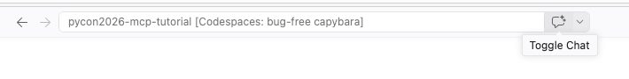
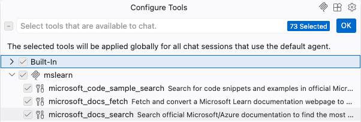

# Exercise 1: Connect to an MCP server

In this exercise, you'll set up a development environment and connect GitHub Copilot to a public MCP server.

- [Step 1: Set up your development environment](#step-1-set-up-your-development-environment)
- [Step 2: Set up GitHub Copilot](#step-2-set-up-github-copilot)
- [Step 3: Use a public MCP server](#step-3-use-a-public-mcp-server)

---

## Step 1: Set up your development environment

Pick **one** of the options below to get the tutorial repository open and ready.

### Option A: GitHub Codespaces (recommended)

Everything is pre-configured — no local installs needed. You just need a [GitHub account](https://github.com/).

1. Login to your GitHub account.
2. Go to [github.com/pamelafox/github-copilot-mcp-tutorial](https://github.com/pamelafox/github-copilot-mcp-tutorial).
3. Click **Code → Codespaces → Create codespace on main**.

   

4. Wait for the Codespace to build. Once the editor loads, you're ready to move on to [Step 2](#step-2-set-up-github-copilot).

### Option B: VS Code + Dev Containers

This runs the same pre-configured environment locally inside a Docker container.

**Prerequisites:**

- [VS Code](https://code.visualstudio.com/) installed
- [Docker Desktop](https://www.docker.com/products/docker-desktop/) installed and running
- [Dev Containers extension](https://marketplace.visualstudio.com/items?itemName=ms-vscode-remote.remote-containers) installed in VS Code

**Steps:**

1. Clone the repository:

   ```bash
   git clone https://github.com/pamelafox/github-copilot-mcp-tutorial.git
   ```

2. Open the folder in VS Code:

   ```bash
   code github-copilot-mcp-tutorial
   ```

3. When prompted "Reopen in Container", click **Reopen in Container**. (Or open the Command Palette and run **Dev Containers: Reopen in Container**.)
4. Wait for the container to build. Once the editor reloads, you're ready to move on to [Step 2](#step-2-set-up-github-copilot).

### Option C: Local environment

If you prefer to work without Docker or Codespaces, you can set up a local Python environment.

**Prerequisites:**

- [uv](https://docs.astral.sh/uv/getting-started/installation/): Python package manager that can also download Python if you don't yet have it instaalled.

**Steps:**

1. Clone (or download) the repository:

   ```bash
   git clone https://github.com/pamelafox/github-copilot-mcp-tutorial.git
   cd github-copilot-mcp-tutorial
   ```

2. Install dependencies:

   ```bash
   uv sync
   ```

3. Open the folder in your editor of choice (VS Code, PyCharm, etc.). Once the editor loads, you're ready to move on to [Step 2](#step-2-set-up-github-copilot).

---

## Step 2: Set up GitHub Copilot

Set up **one** of the GitHub Copilot options below: [GitHub Copilot in VS Code / Codespaces](#option-a-github-copilot-in-vs-code--codespaces) or [GitHub Copilot CLI](#option-b-github-copilot-cli).

### Option A: GitHub Copilot in VS Code / Codespaces

1. Check the right side of VS Code to see if the Copilot Chat side panel is already open. If it's not open, find the "Toggle Chat" icon at the top of VS Code, locate and click it to open the side panel.

   

   > 🪧 **Note:** If this is your first time using GitHub Copilot, you will need to accept the usage terms to continue.

2. Make sure the chat is in **Agent** mode. (You may not see "Agent", but you should see a loop icon which says "Agent" upon clicking.)

   

3. Send a test message "Hello" to confirm the agent is working.
4. Move on to [Step 3](#step-3-use-a-public-mcp-server)

### Option B: GitHub Copilot CLI

> You need a [GitHub Copilot subscription](https://github.com/features/copilot) for this option.

1. Install GitHub Copilot CLI by following the [installation guide](https://docs.github.com/en/copilot/how-tos/copilot-cli/set-up-copilot-cli/install-copilot-cli).
2. Verify the installation:

   ```bash
   copilot
   ```

3. Move on to [Step 3](#step-3-use-a-public-mcp-server)

---

## Step 3: Use a public MCP server

Now connect GitHub Copilot to a **public MCP server** that requires no authentication. The examples below use the MS Learn documentation MCP server, but you can also try other options:

| Server | MCP Server URL | Description |
| --- | --- | --- |
| [Microsoft Learn](https://learn.microsoft.com/training/support/mcp) | `https://learn.microsoft.com/api/mcp` | MS Learn documentation |
| [DeepWiki](https://docs.devin.ai/work-with-devin/deepwiki-mcp) | `https://mcp.deepwiki.com/mcp` | GitHub repository documentation |
| [French government](https://github.com/datagouv/datagouv-mcp) | `https://mcp.data.gouv.fr/mcp` | French government data |

Follow the instructions for your agent: [GitHub Copilot in VS Code](#github-copilot-in-vs-code--public-server) or [GitHub Copilot CLI](#github-copilot-cli--public-server).

### GitHub Copilot in VS Code — public server

1. Open (or create) the file `.vscode/mcp.json` in your workspace and make sure it contains a server configuration pointed at the Microsoft Learn MCP server URL:


   ```json
   {
     "servers": {
       "mslearn": {
         "type": "http",
         "url": "https://learn.microsoft.com/api/mcp"
       }
     }
   }
   ```

2. Select "Start" on the server in the config file.

   

3. In the Copilot Chat panel, click the tools icon to confirm the server tools are listed.

   

   

4. Ask a question that requires context from Microsoft Learn documentation:

   ```text
   What kind of GPUs are available for Azure Container Apps?
   ```

### GitHub Copilot CLI — public server

1. Add the MCP server using the CLI:

   ```bash
   copilot mcp add --transport http mslearn https://learn.microsoft.com/api/mcp
   ```

2. Ask a question that can be answered by the MCP server:

   ```bash
   copilot -i "What kind of GPUs are available for Azure Container Apps?"
   ```
